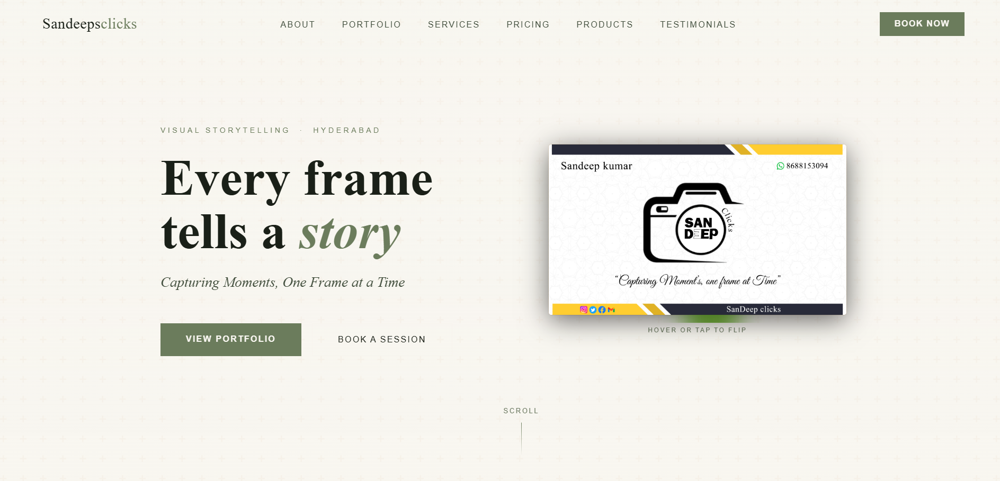
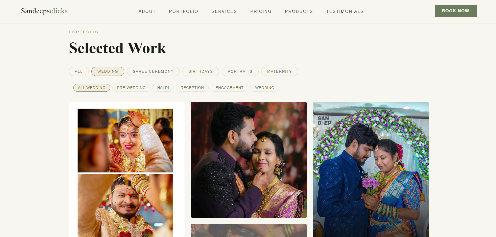
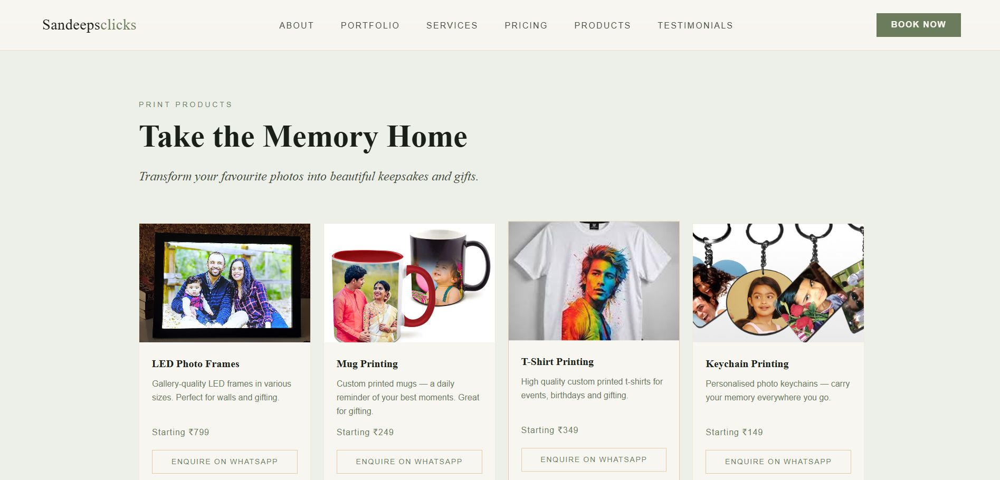
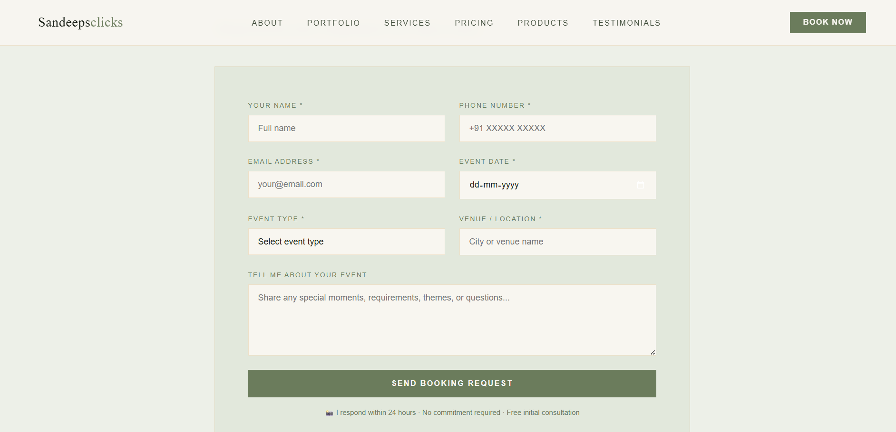
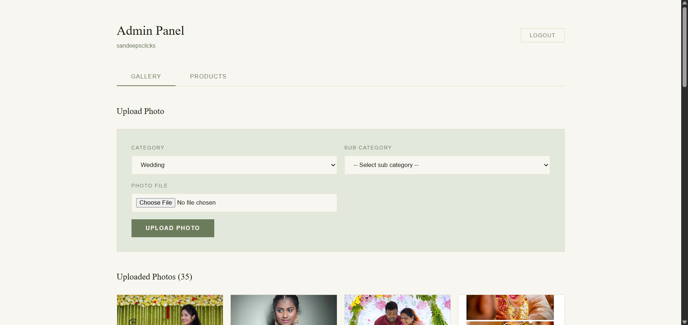
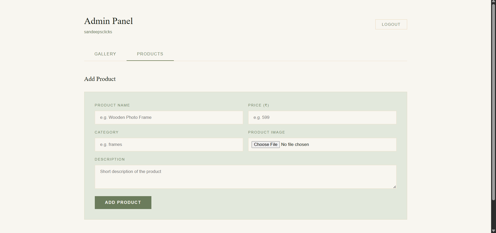

# Sandeep Clicks

A full-stack photography portfolio and business management web application built for a professional photographer. The platform serves as a public-facing portfolio website and an admin dashboard — allowing the photographer to manage their gallery, showcase print products, and accept client bookings, all in one place.

---

## Live Demo

> https://sandeepclicks.netlify.app/

---

### Screenshots









## Features

### Public (Client-Facing)
- Hero section with a cinematic landing banner and call-to-action
- About section with photographer bio and story
- Filterable portfolio gallery organized by categories — Weddings, Saree Ceremony, Birthdays, Portraits, Maternity
- Services overview of photography packages
- Pricing tiers
- Shop to browse print products (albums, frames, etc.)
- Booking form where clients submit enquiries with name, email, phone, event type, date, location, and message
- Testimonials section
- Footer with contact and social links

### Admin Dashboard (/admin)
- Password-protected login with session persistence
- Gallery management — upload single or bulk photos per category and subcategory, delete photos
- Product management — add and delete shop products with images
- Booking management — view all bookings, update status (pending / confirmed / completed), delete bookings
- All images stored on Cloudinary for fast CDN delivery

---

## Tech Stack

| Layer | Technology |
|---|---|
| Frontend | React 19, Vite, React Router v7, Tailwind CSS v4, Axios |
| Backend | Node.js, Express 5 |
| Database | MongoDB (Mongoose) |
| Image Storage | Cloudinary |
| File Uploads | Multer |

---

## Project Structure

```
sandeep-clicks/
├── client/                   # React frontend (Vite)
│   └── src/
│       ├── pages/
│       │   ├── Home.jsx      # Public portfolio page
│       │   └── Admin.jsx     # Admin dashboard
│       ├── components/
│       │   ├── Navbar/
│       │   ├── Hero/
│       │   ├── About/
│       │   ├── Portfolio/
│       │   ├── Services/
│       │   ├── Pricing/
│       │   ├── Shop/
│       │   ├── Booking/
│       │   ├── Testimonials/
│       │   └── Footer/
│       └── api/
│           ├── auth.js
│           ├── gallery.js
│           └── products.js
│
└── server/                   # Node.js + Express backend
    ├── server.js
    ├── config/
    │   ├── db.js
    │   └── cloudinary.js
    ├── models/
    │   ├── gallery.js
    │   ├── Product.js
    │   └── booking.js
    ├── controllers/
    │   ├── galleryController.js
    │   ├── productController.js
    │   ├── bookingController.js
    │   └── authController.js
    ├── routes/
    │   ├── galleryRoutes.js
    │   ├── productRoutes.js
    │   ├── bookingRoutes.js
    │   └── authRoutes.js
    └── middleware/
        └── auth.js
```

---

## Getting Started

### Prerequisites
- Node.js v18+
- MongoDB Atlas account (or local MongoDB)
- Cloudinary account

### 1. Clone the Repository

```bash
git clone https://github.com/aishwaryaKurakula/sandeep-clicks.git
cd sandeep-clicks
```

### 2. Set Up the Server

```bash
cd server
npm install
```

Create a `.env` file in the `server/` directory:

```env
PORT=5000
MONGO_URI=your_mongodb_connection_string
CLOUDINARY_CLOUD_NAME=your_cloud_name
CLOUDINARY_API_KEY=your_api_key
CLOUDINARY_API_SECRET=your_api_secret
ADMIN_PASSWORD=your_secure_admin_password
```

Start the server:

```bash
npm start
```

### 3. Set Up the Client

```bash
cd ../client
npm install
```

Create a `.env` file in the `client/` directory:

```env
VITE_API_URL=http://localhost:5000
```

Start the dev server:

```bash
npm run dev
```

The app will be available at `http://localhost:5173`.

---

## API Endpoints

### Auth
| Method | Endpoint | Access | Description |
|---|---|---|---|
| POST | `/api/auth/login` | Public | Admin login |

### Gallery
| Method | Endpoint | Access | Description |
|---|---|---|---|
| GET | `/api/gallery` | Public | Fetch all photos |
| GET | `/api/gallery/:category` | Public | Fetch photos by category |
| POST | `/api/gallery` | Admin | Upload a single photo |
| DELETE | `/api/gallery/:id` | Admin | Delete a photo |

### Products
| Method | Endpoint | Access | Description |
|---|---|---|---|
| GET | `/api/products` | Public | Fetch all products |
| GET | `/api/products/:id` | Public | Fetch a single product |
| POST | `/api/products` | Admin | Add a product |
| DELETE | `/api/products/:id` | Admin | Delete a product |

### Bookings
| Method | Endpoint | Access | Description |
|---|---|---|---|
| POST | `/api/bookings` | Public | Submit a booking enquiry |
| GET | `/api/bookings` | Admin | View all bookings |
| PATCH | `/api/bookings/:id` | Admin | Update booking status |
| DELETE | `/api/bookings/:id` | Admin | Delete a booking |

---

## Admin Access

Navigate to `/admin` on the frontend and enter the admin password set in your server `.env`. The session is stored in `sessionStorage` so you stay logged in for the duration of the browser tab.

---

## Deployment


## Backend (Render)
1. Set all environment variables from your `.env` in the Render dashboard
2. Set the start command to `node server.js`
### Frontend (Netlify)
1. Set the build command to `npm run build` and publish directory to `dist`
2. Add `VITE_API_URL` pointing to your deployed Render backend URL
3. Add a `_redirects` file inside `client/public/` for SPA routing:
```
/*    /index.html   200
```
 
---

---

## Gallery Categories

| Category | Subcategories |
|---|---|
| Wedding | Pre-Wedding, Haldi, Reception, Engagement, Wedding |
| Saree Ceremony | Saree Ceremony, Dhoti |
| Birthdays | Birthdays, Naming Ceremony |
| Portraits | — |
| Maternity | — |

---

## License

This project is open source and available under the MIT License.

---

## Built By

Aishwarya Kurakula — Full-stack developer  
[GitHub](https://github.com/aishwaryaKurakula) · [Medium](https://medium.com/@aishwaryKurakula)
